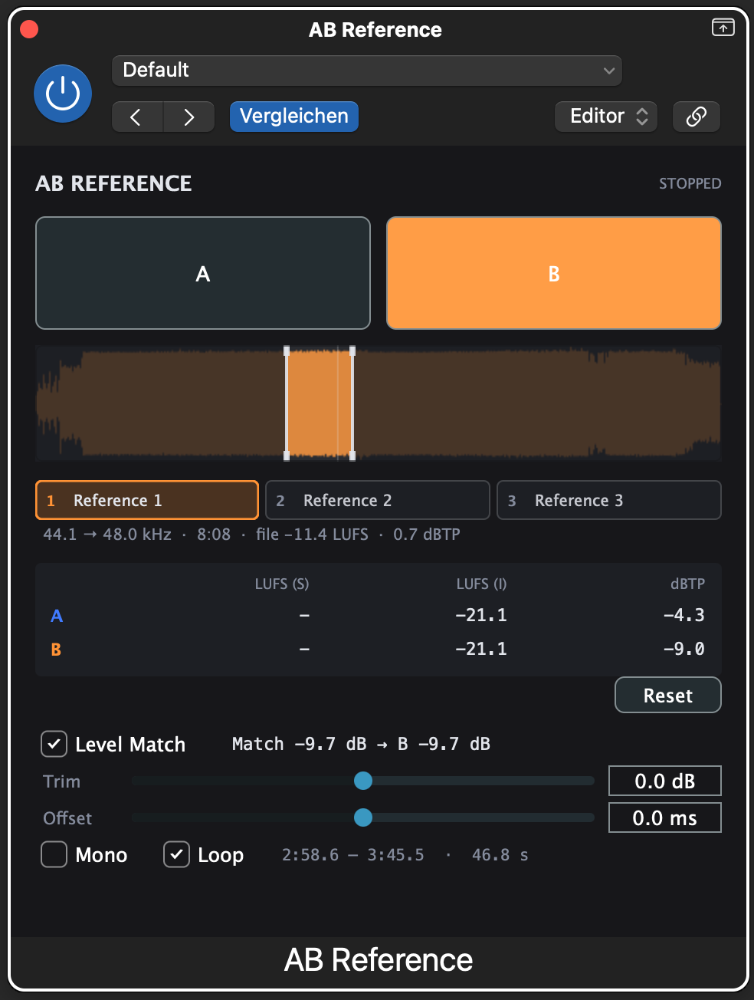

# AB Reference

A mastering A/B plugin for macOS: Audio Unit, VST3 and Standalone.



No network code, no telemetry, no account. `JUCE_USE_CURL=0` and
`JUCE_WEB_BROWSER=0` are set at the build level, not just left unused.

It sits at the **end** of the master chain and switches between:

- **A** — what your chain just produced
- **B** — one of **three** references from disk, each level-matched

The level match is the point. An A/B between two masters at different loudness is
a test of which one is louder, not of which one is better. B is matched to A.
**A is never touched** — not by the trim, not by the match, never.

## Building

```bash
Scripts/build.sh
```

Needs JUCE 9 in `~/JUCE`, CMake and Xcode. The script builds every target and then
runs `MeterCheck`, which checks the meters against signals whose loudness is known
from the standard.

```bash
Scripts/install.sh
```

Copies the AU and VST3 into `~/Library/Audio/Plug-Ins`, flushes the AU cache and
runs `auval`. The cache flush is the part that matters: without it Logic keeps
serving the previous build, and the next hour is spent testing a binary from
before the fix.

```bash
Scripts/package.sh
```

Builds `build/AB Reference <version>.pkg` — the AU and the VST3, either of which
the user can deselect. It runs `Scripts/build.sh` first, so there is no path to an
installer that skips MeterCheck: packaging a binary nobody verified is how a meter
that is quietly wrong gets shipped. The version comes out of the built bundle's
`Info.plist` rather than being typed into the script, so it cannot drift from
`project()` in `CMakeLists.txt`. The Standalone is not in the installer; it is a
development tool, not a product.

The installer declares `arm64` and the deployment target, so it refuses on an
Intel Mac or an older system instead of installing a plugin that cannot load.

**It installs into `/Library`, while `install.sh` installs into `~/Library`.** Run
both and there are two copies of the plugin on the machine, which is its own kind
of afternoon. `install.sh` is the development path; the installer is the shipping
path. Before testing the installer, take the development copies out:

```bash
rm -rf ~/Library/Audio/Plug-Ins/Components/"AB Reference.component" ~/Library/Audio/Plug-Ins/VST3/"AB Reference.vst3"
```

**The installer is not signed.** There is no Developer ID Installer certificate on
this machine — only an Apple Development one, which is for running your own builds
locally and is refused by Gatekeeper everywhere else. Signing with it would produce
an installer that looks signed and still gets refused, which is worse than an
honestly unsigned one, so `package.sh` signs only if a real Developer ID Installer
identity appears and says plainly what it did either way. The plugins themselves
are ad-hoc signed by the toolchain, and the AU's signature sits in the executable
rather than on the bundle. All of that is fine on this machine and none of it is
enough to distribute: that needs a Developer ID Application certificate for the
plugins, a Developer ID Installer certificate for the package, and notarisation.

## Using it

| | |
|---|---|
| **A / B** | The switch. Space or `B` toggles, `A` goes straight to A. 8 ms equal-power crossfade. |
| **Slots 1 / 2 / 3** | Click to select a reference and hear it; `1` `2` `3` do the same. Double-click or right-click to load; right-click to clear that slot. Drop a file on a slot to load *that* slot; drop it anywhere else and it fills the first empty one. WAV, AIFF, FLAC, MP3, M4A, AAC. |
| **Level Match** | Puts B at A's integrated loudness. The amount applied is shown next to it. |
| **Trim** | Manual, ±12 dB, adds on top of the match. |
| **Offset** | Shifts the reference along the timeline. Also the correction for host PDC quirks. |
| **Mono** | Sums what you are hearing to mono. Bass and phase problems show up there and nowhere else. |
| **Loop** | Repeat the reference instead of falling silent at its end. |
| **Waveform** | The reference, drawn. Drag across it to loop a section; drag either edge to move it; click once to go back to the whole file. Selecting a section switches Loop on. |
| **Reset** | Clears integrated LUFS and the held true peak on both sides. |

The reference follows the timeline: reference sample 0 sits at timeline position 0,
shifted by the offset. With the transport stopped, B is silent.

Each slot keeps **its own loop region**, because "from 0:47" is a different place
in a different song. Switching slots brings that slot's marked section back with
it. Switching is an 8 ms equal-power crossfade, same as the A/B button.

**Except inside a loop region.** Once a section is selected, that section is all B
plays: it starts when the transport does and repeats, wherever the host happens to
be. That is deliberate — looping a reference chorus against your own mix is the
point of the control — but it does mean B is no longer sample-aligned with A while
a region is set. Clear the region and the alignment comes back.

## What is in it, and why

**Reported latency is 0, always.** Nothing here looks ahead. `setLatencySamples(0)`
is called exactly once, in the constructor, and there is deliberately no second
call anywhere in the project: reporting latency from the last slot of a master
chain would make the host delay everything feeding it, and a *changing* latency
makes the host re-plan its graph mid-session.

What PDC actually threatens here is the other direction — plugins *before* this
one that do have latency. If the host delays the audio while its clock keeps
running, B ends up ahead of A by the chain's latency. Hosts differ; the offset
control is the correction, and the null test below is the measurement.

**No disk access and no `free()` in `processBlock`.** Decoding, resampling and
measuring happen on a background thread. The audio thread only exchanges a pointer
in an atomic slot and parks the old one in one of eight retire slots, which a timer
on the message thread empties. If all eight are full the audio thread declines the
swap and keeps playing what it has. There is no path here that allocates, frees,
blocks, or drops a sample.

**Every slot has its own match gain.** Each reference has its own loudness, so
each has its own match, and the gain is applied to each slot's audio *before* the
slots are mixed. One gain applied after the mix would be right for at most one of
the two references involved in a switch. `MeterCheck` asserts it: two references
genuinely 10 LU apart, each matched to the same A, come out level.

**LUFS to BS.1770-4, with derived coefficients.** The coefficient table everyone
copies is the 48 kHz case and nothing else. Here it is computed for the actual
sample rate from the bilinear transform, and `MeterCheck` asserts that the
derivation reproduces the published table at 48 kHz to seven digits — which is
what makes it trustworthy at 44.1 and 96 kHz, where no published table exists to
check against.

**Bypass** is defined: the output is the input, bit for bit; the reference stops;
the meters keep running on A; the match value holds. The way there is an 8 ms fade
rather than a jump.

**The loop seam is crossfaded, 10 ms, equal power.** A wrap is a step in the
signal and a step is a click. The blend is an overlap-add: the selection's last
10 ms are mixed onto its first 10 ms and the repeat runs from there, which is
continuous at both ends and reads nothing outside what you selected. Two things
follow from that, worth knowing rather than being surprised by. A repeat is 10 ms
shorter than the selection — the price of a crossfade that never plays audio you
did not select, and the only version of it that also works when the selection
starts at sample zero. And the first pass through a selection is clean; only the
repeats cross a seam, because there is nothing before the first pass to blend
with.

## Verification

`MeterCheck` (which `Scripts/build.sh` runs) checks 123 things against sources
outside this project — BS.1770-4, EBU Tech 3341, and arithmetic on the definitions.
It has already found two real bugs:

- The true-peak meter read **+0.81 dBTP high** on the first samples after
  `prepare()`, because an oversampling FIR overshoots from zeroed state. It now
  primes itself.
- The resampler had a flat **−0.087 dB** gain error, identical at every frequency —
  JUCE's sinc kernel is not normalised to unity. The factor is now measured rather
  than written down, so that a future JUCE release cannot turn the correction into
  an error of the same size in the other direction.

`EditorShot` renders the panel headlessly to a PNG — no DAW and no screen-recording
permission needed. That is what caught the UTF-8 bug that turned the arrow in
"44.1 → 48 kHz" into mojibake. It renders twice: `editor.png` is the empty panel,
and `editor-loaded.png`, from `--demo`, synthesises a reference, **drags a loop
region out with simulated mouse events**, and checks that the parameters moved and
that Loop switched itself on. Setting those parameters directly would have produced
the same picture and proved nothing; the gesture is the half of the feature worth
testing, and driving it this way caught a real ordering bug the first time it ran.

It also used to append each render to the previous one — `createOutputStream` opens
an existing file at its end, and a decoder stops at the first image in the file, so
every picture after the first was invisible and you were always looking at the
build before the change you were checking. Five images deep by the time it was
found.

### The null test — the PDC measurement, and what it measured

The one thing that can only be measured inside a host. This is the **Loop off**
measurement, and Loop off is the only state in which it means anything: a loop
region deliberately breaks the alignment between A and B, so nulling against one
would be measuring the region rather than the plugin. With Loop off the reference
read is byte for byte what it was before loop regions existed, which is what keeps
the numbers below current. Run in Logic Pro 12.3.1,
48 kHz project, 48 kHz reference, level match off, offset 0, loop off:

1. Put the reference file on an audio track at bar 1, and load the same file as
   the reference.
2. Bounce once with A selected and once with B, then sum the two with one
   inverted.

**Result, with nothing else in the chain: a bit-exact null.** Zero differing
samples out of 24,576,000 across a 256 s bounce; peak difference −∞ dBFS. Both
bounces were also bit-identical to the source file, and both stopped at exactly
the same sample. Logic's reported `timeInSamples` maps to the reference sample
for sample.

**With a linear-phase EQ inserted upstream** — real latency for the host to
compensate — the null is bit-exact for 255.99 seconds of the 256, with one
exception: for the **first 288 samples (6.00 ms) the reference sits exactly one
sample early**, then it is exact for the rest of the bounce. So Logic's first
reported position after the transport starts is one sample ahead of the audio it
hands over when upstream latency is being compensated, and it settles
immediately. At 20.8 µs, for 6 ms, at the very start of playback, this is far
below anything an A/B comparison can resolve; it is recorded here because it is
the kind of thing that is worth knowing rather than worth fixing. Guessing at a
correction would be trading a measured 1-sample artefact for an unmeasured one.

**Two traps, both of which cost an hour here.**

*Logic's metronome bounces.* At 120 BPM it puts a click every 24000 samples into
A and not into B, which reads as a catastrophic null failure — a −0.9 dBFS
residual — and looks like a plugin bug. Worse, if the test signal has its own
transients on the beat, the metronome lands on top of them and looks like the
plugin amplifying transients. Turn the click off before bouncing.

*Bounce normalisation defaults to on.* It scales A and B independently, so
nothing can null. Set **Normalise: off** and **Dithering: none** in the bounce
dialog.

## Limits

- Stereo in, stereo out. Mono references are duplicated; files with more than two
  channels are reduced to the first two.
- References up to 30 minutes each, and 768 MB of decoded audio across all three
  slots together. A load that would exceed the budget is refused with a message
  saying what the other slots are holding, rather than being truncated.
- Logic hosts audio units in a sandboxed process. A stored path can be unreadable
  when a session is reloaded; the plugin then shows "Reference could not be loaded"
  and keeps the path visible. Security-scoped bookmarks would be the proper fix and
  are a V2 item.

## Licence

AGPLv3 — see [LICENSE](LICENSE). This follows from linking JUCE's free
tier, which is AGPLv3 itself; details in
[THIRD_PARTY_NOTICES.md](THIRD_PARTY_NOTICES.md).

## Contact

T'Zorr — <TZorr@gmx.de>
